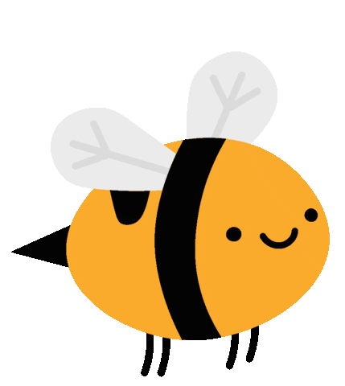
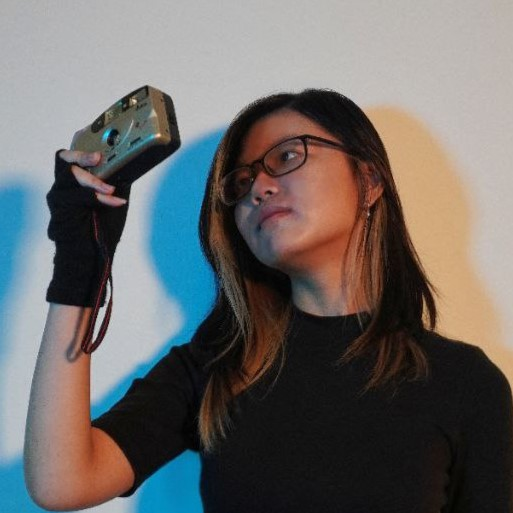

## Hellos! 

Aspiring full-stack developer :computer: with a penchant for arts :art:

- ⚙️ I use: `java`, `javascript`, `typescript`, `C`, `python`
- :framed_picture: I design with: `inkscape`, `illustrator`, `canva`, `clip studio paint`
- :school: studying in: `Nanyang Technological University - Computer Science`

   

## How To Reach Me ‎ 

  

  

  

<!--
**faybeez/faybeez** is a ✨ _special_ ✨ repository because its `README.md` (this file) appears on your GitHub profile.

Here are some ideas to get you started:
s
- 🔭 I’m currently working on ...
- 🌱 I’m currently learning ...
- 👯 I’m looking to collaborate on ...
- 🤔 I’m looking for help with ...
- 💬 Ask me about ...
- 📫 How to reach me: ...
- 😄 Pronouns: ...
- ⚡ Fun fact: ...
-->
